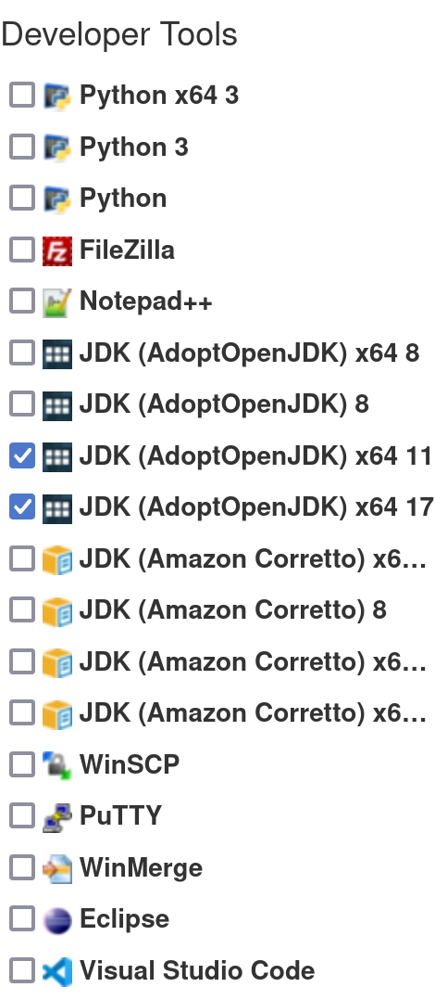

# CSCD 212 Spring 2023 Setup

Welcome to Object Oriented Programming, Let set things up we need for this class.

## TODO:

- [ ] Get GitHub Student Developer Pack
- [ ] Get Jet brains toolbox
- [ ] Make a pull request to this repo
- [ ] Put your GitHub user name, school email and screen shots to canvas
  - [ ] GitHub User name 
  - [ ] School EMail
  - [ ] Screen shots
    - [ ] Sign up for GitHub Student Developer Pack
    - [ ] Pull Request

## Tips:

This to help with the to-do list

### GitHub Student Developer Pack

Link to it https://education.github.com/pack

Click `Sign up for Student Developer Pack`

Use you EWU email and GitHub will auto select `Eastern Washington University`

When it ask for your student ID give a screen shot for your Student Page

> `Eagle Net` -->  Log In --> `Student` --> `Student Profile` 

> `Eagle Net` https://ssb-prod.ec.ewu.edu/ssomanager/saml/login?relayState=/c/auth/SSB

### Get Jet brains toolbox

Tool Box: https://www.jetbrains.com/toolbox-app/

Student pack: https://www.jetbrains.com/student/?authMethod=github

> Tip: To download java (JDK (AdoptOpenJDK) x64 17) use https://ninite.com/ under developer tools
>
> 

### Make a pull request

> Tip use GitKraken https://www.gitkraken.com/github-student-developer-pack
>
> 

Many examples at https://github.com/firstcontributions/first-contributions

#### Steps

1. Fork

   1. Click the fork button in the repo

      

      > Tip: Keep the name
      >
      > Tip: Make your fork private

2. Clone Fork

   1. Go to your fork and click clone 

      

      > Do Not Click Download

   2. Copy the git link

      

      > Look like `https://github.com/YOURUSERNAME/cscd212-s23-setup.git`
      >
      > Not `https://github.com/EWU-CSCD212/cscd212-s23-setup.git`

   3. Run `git clone`  + the link

      > Install git https://git-scm.com/downloads
      >
      > On windows use shift + right click to use the open with power shell 
      >
      > - so you do not have to navigate (`cd`) to where you want to clone to in terminal  

3. Make branch

   > Run `git switch -c your-new-branch-name` command in the root of the repo
   >
   > Tip: Use your name for the branch name
   >
   > Tip: Change dir to into repo `cd cscd212-s23-setup` before running the command

4. Make change

   > Copy the `readme.md` file to your own name and make a change to the file
   >
   > Tip: Copy command `cp readme.md yourname.md` 

5. Stage changes

   > Run `git add yourname.md` command in the root of the repo
   >
   > Tip: If there is a `.gitignore` file in root of project you can use `git add .` instead

6. Commit changes

   > Run `git commit -m "Add your-name todolist"` command in the root of the repo

7. Push changes

   > Run `git push -u origin your-branch-name` command in the root of the repo

8. Make pull request with the changes you made

   1. Go to your repo you fork

      > The link to yours look like https://github.com/YOURUSERNAME/cscd212-s23-setup

   2. There will be a `Compare & pull request` button

      

   3. Click Create pull request button

      